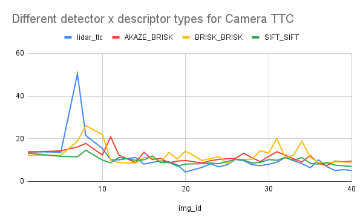

# SFND 3D Object Tracking

This is part of the Udacity Sensor Fusion Nanodegree.

In this project, I implemented the missing parts in the schematic:

1. Developed a way to match 3D objects over time by using keypoint correspondences. 
2. Computed the TTC based on Lidar measurements. 
3. Computed the TTC based on two camera frames, which required to first associate keypoint matches to regions of interest and then to compute the TTC based on those matches.

The following are reports on the various tests conducted with the framework. 

## Instances where the Lidar-based TTC estimate is off

The following pictures were taken running on SIFT/SIFT for camera-based TTC.

### Erroneous lidar at small speeds

Small fluctuations in lidar data can lead to wrong results when relative speed between the ego vehicle and the front vehicle is small. On the graph above we see a wrong estimate at frame 7.

Estimated distance delta (frame 6 and 7) is 2cm, but the real distance delta is about 6cm. A 4cm distance error leads to a large TTC error.
The effect can persist even when vehicles start moving again, as can be seen in frame 8:

One frame where the lidar measurement is plausible is frame 1:

### Other potential reasons

The reflection of the lidar in reflective surfaces (like the metallic surface of the front car) can create incorrect values. 
These errors are more significant if the front car is closer.

## Finding suitable detector/descriptor combos for camera-based TTC estimation

### Find out which methods perform best

Run the program with the command line argument `-series` and pipe the `stdout` to a text file to get data on all the different detector / descriptor combinations. We observe the following:

* some detectors/descriptors extract far fewer keypoints on the image set than others (e.g. `HARRIS`/`SIFT` or `ORB`/`BRISK` are pretty unsuccessful)
* the ratio of matched to unmatched keypoints varies wildy  

Assuming that the lidar yields good estimates except for obvious outliers as discussed in the previous section, and that a small difference between
lidar and camera-based TTC estimate means that both come close to a ground truth, we can use the standard deviation of the difference between lidar 
and camera as a quality measure. 

According to this measure, and including only image frames that can be processed across all detector/descriptor combos, 
SIFT is often better than other detector types. The best combo however on the sample selected is ORB/ORB, closely followed by ORB/SIFT. A small
selection of combos is shown in the following graph, which plots the camera-based TTC estimate versus the frame id.

### Examples where camera-based TTC estimation is off

Whether and how strongly camera-based TTC might be off in its estimation depends on the descriptor and detector type. One combination that performs
particularly poorly is AKAZE/ORB. This combo

* has particularly low numbers of keypoints
* has a particularly bad match ratio of keypoints across frames

Examples where it is especially off include frame no 11 and 15 (see the results Excel in this repo).

## Dependencies for Running Locally
* cmake >= 2.8
  * All OSes: [click here for installation instructions](https://cmake.org/install/)
* make >= 4.1 (Linux, Mac), 3.81 (Windows)
  * Linux: make is installed by default on most Linux distros
  * Mac: [install Xcode command line tools to get make](https://developer.apple.com/xcode/features/)
  * Windows: [Click here for installation instructions](http://gnuwin32.sourceforge.net/packages/make.htm)
* Git LFS
  * Weight files are handled using [LFS](https://git-lfs.github.com/)
* OpenCV >= 4.1
  * This must be compiled from source using the `-D OPENCV_ENABLE_NONFREE=ON` cmake flag for testing the SIFT and SURF detectors.
  * The OpenCV 4.1.0 source code can be found [here](https://github.com/opencv/opencv/tree/4.1.0)
* gcc/g++ >= 5.4
  * Linux: gcc / g++ is installed by default on most Linux distros
  * Mac: same deal as make - [install Xcode command line tools](https://developer.apple.com/xcode/features/)
  * Windows: recommend using [MinGW](http://www.mingw.org/)

## Basic Build Instructions

1. Clone this repo.
2. Make a build directory in the top level project directory: `mkdir build && cd build`
3. Compile: `cmake .. && make`
4. Run it: `./3D_object_tracking`.
