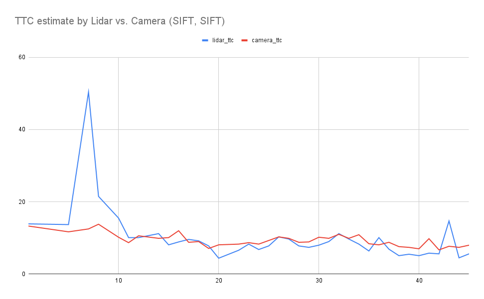
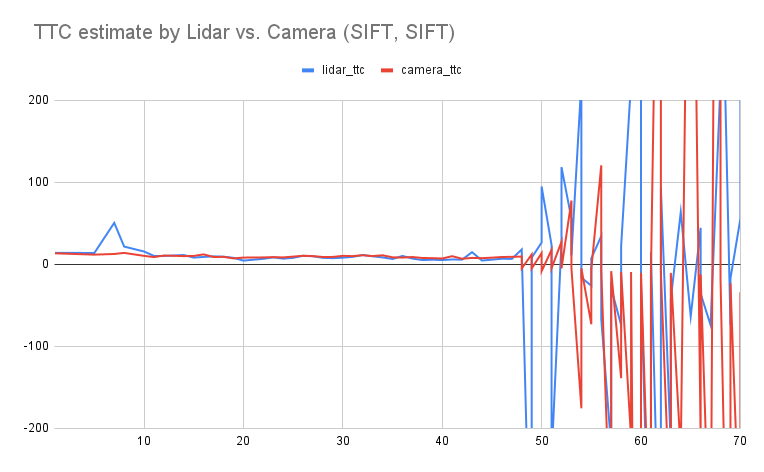

# SFND 3D Object Tracking

This is part of the Udacity Sensor Fusion Nanodegree.

In this project, I implemented the missing parts in the schematic:

1. Developed a way to match 3D objects over time by using keypoint correspondences. 
2. Computed the TTC based on Lidar measurements. 
3. Computed the TTC based on two camera frames, which required to first associate keypoint matches to regions of interest and then to compute the TTC based on those matches.

## Code documentation

### Match 3D Objects

The matching of 3D objects is implemented in `matchBoundingBoxes`. It takes one match at a time and determines which boxes each point of the match belongs to.
Then we count the number of correspondences between boxes across frames. Finally we select pairs of boxes that have the highest number of keypoint matches between them.

### Compute Lidar-based TTC

Lidar-based TTC is implemented in `computeTTCLidar`. An important helper function is `nthSmallestDistance` which takes a set of lidar points and returns the Nth smallest distance in x-direction of a collection of lidar points, or the largest distance among n < N x-distances if there are no N distances. This serves to
remove outliers in the distance data. Experiments yield N = 7 as a suitable choice. Then the formula for a constant velocity model is used to estimate the TTC.

### Associate Keypoint Correspondences with Bounding Boxes

This is implemented in `clusterKptMatchesWithROI`. For each matched pair of keypoints we check if the previous keypoint and current keypoint are within the same bounding box. We compute the euclidean distance between them and collect pairs of matches and distances into a vector. Then we filter out outliers based on the distance between the two keypoints using IQR as a means to identify the outliers.

The following animation shows the keypoints found by SIFT/SIFT. These keypoints are matched per bounding box across frames (not shown in animation).

### Compute Camera-based TTC

In `computeTTCCamera` we first compute the distance ratios between all matched keypoints. Then we use the median of the distance ratios as an input to the formula to compute the TTC.

The following animation shows the TTC-estimates for camera for the SIFT/SIFT combo.

## Instances where the Lidar-based TTC estimate is off

The following are reports on the various tests conducted with the framework. The following pictures were taken running on SIFT/SIFT for camera-based TTC.

### Erroneous lidar at small speeds

Small fluctuations in lidar data can lead to wrong results when relative speed between the ego vehicle and the front vehicle is small. On the graph above we see a wrong estimate at frame 7. Compare the top views for frame 7 and 14 respectively:

   

There are several ghost points in frame 7 that confuse the algorithm. After that frame the lidar is in range with the TTC estimate by the camera.

Another cause is varying relative speed, since we're working with a model that presumes constant relative speed.

The reflection of the lidar in reflective surfaces (like the metallic surface of the front car) can create incorrect values. 
These errors are more significant if the front car is closer. When front and ego car stop at the very end of the sequence, 
both estimates become highly unreliable as can be seen in the longer time series above. The animation shows that the back light of the 
front car is used for estimation instead of the whole back of the front car.

## Finding suitable detector/descriptor combos for camera-based TTC estimation

### Find out which methods perform best

Run the program with the command line argument `-series` and pipe the `stdout` to a text file to get data on all the different detector / descriptor combinations. We observe the following:

* some detectors/descriptors extract far fewer keypoints on the image set than others (e.g. `HARRIS`/`SIFT` or `ORB`/`BRISK` are pretty unsuccessful)
* the ratio of matched to unmatched keypoints varies wildy  

Assuming that the lidar yields good estimates except for obvious outliers as discussed in the previous section, and that a small difference between
lidar and camera-based TTC estimate means that both come close to a ground truth, we can use the standard deviation of the difference between lidar 
and camera as a quality measure. 

According to this measure, and including only image frames that can be processed across all detector/descriptor combos, 
SIFT is often better than other detector types. The best combo however on the sample selected is ORB/ORB, closely followed by ORB/SIFT. A small
selection of combos is shown in the following graph, which plots the camera-based TTC estimate versus the frame id.

### Examples where camera-based TTC estimation is off

Whether and how strongly camera-based TTC might be off in its estimation depends on the descriptor and detector type. One combination that performs
particularly poorly is AKAZE/ORB. This combo

* has particularly low numbers of keypoints
* has a particularly bad match ratio of keypoints across frames

Examples where it is especially off include frame no 11 and 15 (see the results in `dat/output` in this repo).

Towards the very end of the sequence the algorithm confuses objects and starts measuring the distance to the truck to the front right.

## Dependencies for Running Locally
* cmake >= 2.8
  * All OSes: [click here for installation instructions](https://cmake.org/install/)
* make >= 4.1 (Linux, Mac), 3.81 (Windows)
  * Linux: make is installed by default on most Linux distros
  * Mac: [install Xcode command line tools to get make](https://developer.apple.com/xcode/features/)
  * Windows: [Click here for installation instructions](http://gnuwin32.sourceforge.net/packages/make.htm)
* Git LFS
  * Weight files are handled using [LFS](https://git-lfs.github.com/)
* OpenCV >= 4.1
  * This must be compiled from source using the `-D OPENCV_ENABLE_NONFREE=ON` cmake flag for testing the SIFT and SURF detectors.
  * The OpenCV 4.1.0 source code can be found [here](https://github.com/opencv/opencv/tree/4.1.0)
* gcc/g++ >= 5.4
  * Linux: gcc / g++ is installed by default on most Linux distros
  * Mac: same deal as make - [install Xcode command line tools](https://developer.apple.com/xcode/features/)
  * Windows: recommend using [MinGW](http://www.mingw.org/)

## Basic Build Instructions

1. Clone this repo.
2. Make a build directory in the top level project directory: `mkdir build && cd build`
3. Compile: `cmake .. && make`
4. Run it: `./3D_object_tracking`.
